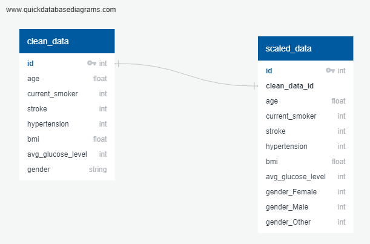
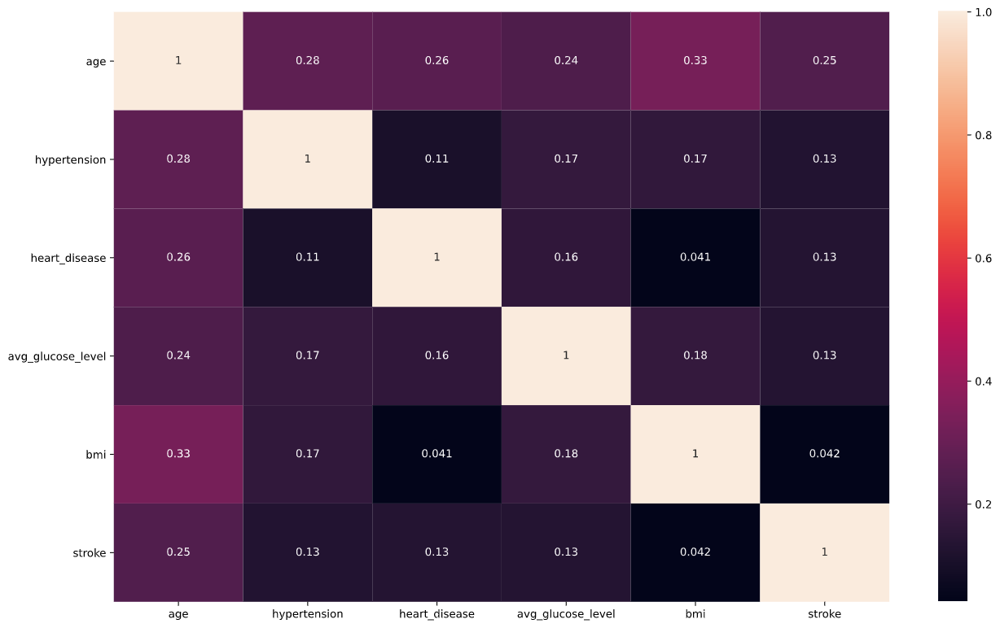

# Stroke Data Analysis

## Selected topic

Our group chose to analyze stroke data from a national database. We selected this topic because of our shared interest in healthcare. We realized that some of the tools acquired in this course would allow us to investigate this data in unique and informative ways.

## Description of the source of data

This data was pulled from Kaggle and is a private data source. It includes information such as age, gender, marital status, smoking history, avg blood sugar readings, known heart disease and whether or not the patient had a stroke. It lists data for about 5000 patients.

## Questions we hope to answer

We hope to get answers from the data include identifying clusters of patients at risk for stroke and better understanding to what extent certain risk factors are predictive of stroke risk.

## Outline

Our aim was to predict stroke outcomes based off of common risk factors.
We determined to analyze our stroke data in the following steps:

1. Find data - we chose stroke data because of our shared interest in healthcare
2. Seek out comparable data for comparison
3. Merge data
4. Save to database on PostgreSQL (Amazon's document DB external access was outside of VCS and was prohibitive)
5. Investigate descriptive stats using Tableau, Pandas, R, apply findings to presentation slides
6. Scale model
7. Run random forest, compare to other machine learning tools
8. Present findings for final project
9. Discuss with participants

## Machine Learning

### Data Preprocessing

- Merged the 2 csv data files into one file by matching like fields and standardizing the data to have the match.
- Removed all people under the age of 18.
- Converted boolean gender (is_male = 1/0) to be text gender (gender = Male/Female/Other)
- Simplified the fields of somking to simple boolean field of current_smoker.
- Saved the final data to a csv to be used for tableau.
- Saved the data into Amazon RDS for future use.

### Machine Learning Model

- Pull the clean and merged data from the database.
- Encoded the gender field to 3 fields (gender_Male/gender_Female/gender_Other)
- Saved the encoded data to the database with a foreign key of the original data for data integerity.
- Since we were looking for stroke risk in other areas, we split the data for stoke column and all the others without the stroke columns.
- The data was then split into 2 categories, stroke training/stroke testing, features test and training. This split was so that we could train the machine learning model and have a seperate data to see how accurate the machine model predicting was.
- Choose to use TensorFlow due to learning how it was used to help identify population that might be at higher risk for Covid-19 infection.
- Used 2 hidden layers and 1 output layer to build the neural network using the sequential model.
- Tried both 100 epochs and there wasn't much difference than 1 epoch to build the model. They both stayed about 97% accurate.
- The model was saved to be used for future predictions to be used in the web application.

## Presentation

This is our presentation about the project.

Google Slides Link: <https://docs.google.com/presentation/d/17cFCFnLW4qrUeIxmmtPW_RbE7PYHm5CGyeRSKDeG2SQ/edit#slide=id.gd9369ee227_0_84>

## Link to Dashboard

We used Tableau to build out the dashboard and used the story feature to describe what was being observed. You can interact with the graphs to see certian data points as well.

Tableau Public Link: <https://public.tableau.com/app/profile/matthew.harmon1936/viz/data_analytics_final_project_dashboard/StrokeRiskDataAnalysis>

## Stroke Prediction Website

This is where you can interact with the machine learning model and make predictions with the given fields.

<https://stroke-risk-analysis.herokuapp.com/>

## Database

I am saving the merged data and encoded data to a Amazon's RDS service using PostgreSQL using the stroke_data_etl notebook. Machine learning model notebook (Stroke Risks.ipynb) encoded the data for use with the machine learning model and saves it to the database with the foreign key of the other table for data integrity.

The design:

## Analysis

